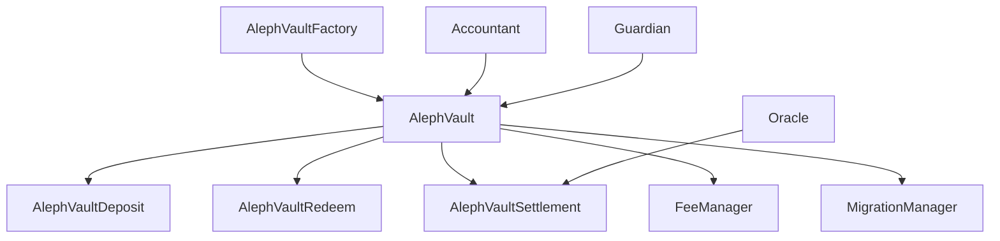

# Aleph Protocol

<div align="center">

[](https://github.com/Othentic-Labs/Aleph//actions/workflows/test.yml)
[](LICENSE)
[](https://getfoundry.sh/)
[](https://soliditylang.org/)

Aleph is a financial infrastructure for uncorrelated yield strategies, connecting digital asset allocators with institutional money managers.

[Documentation](https://docs.aleph.finance) • [Website](https://aleph.finance) • [Twitter](https://x.com/Alephfi) • [GitHub](https://github.com/AlephFi/smart-contracts)

</div>

---

## Overview

Aleph Vault tokenizes off-chain yield strategies into asynchronous vaults, deriving their value from the underlying NAV.
The system simplifies complex operations for managers and allocators, handles whitelisting, subscriptions, Classes and Series, HWM, fee accrual, and capital distribution.

Aleph Vault operates as a settlement-based system; deposits/redemptions are settled only after a new NAV is published. The vault manager initiates NAV updates and settlement cycles, and the whitelisted vault is used as the “subscription escrow”.

### Features
- Customization: apply custom parameters for subscription, fee logic, and other key controls. 
- Fee management: calculated per class/series and enforced by contracts.
- Built-in compliance: whitelisted access through a verification process.
- Canonical states: deposits/redemptions settle in batches at the same per-share price.

---

## 🏗️ Architecture


### Core Components



### Smart Contract Overview

| Contract | Purpose | Key Features |
|----------|---------|--------------|
| **AlephVaultFactory** | Vault deployment and management | CREATE2 deployment, protocol parameters |
| **AlephVault** | Main vault logic | Async operations, share management |
| **AlephVaultDeposit** | Deposit handling | Async deposits, batch processing |
| **AlephVaultRedeem** | Redemption handling | Async redemptions, notice periods |
| **AlephVaultSettlement** | NAV settlements | Oracle integration, batch settlements |
| **FeeManager** | Fee management | Management & performance fees |
| **Accountant** | Fee accounting | Protocol-level fee tracking |
| **MigrationManager** | Upgrades | Safe contract migrations |

---

## 🚀 Quick Start

### Prerequisites

- [Foundry](https://getfoundry.sh/) - Smart contract development toolkit
- [Node.js](https://nodejs.org/) v18+ - For TypeScript scripts
- [Git](https://git-scm.com/) - Version control

### Installation

```bash
# Clone the repository
git clone https://github.com/AlephFi/smart-contracts.git
cd Aleph

# Install Foundry dependencies
forge install

# Install Node.js dependencies (for scripts)
npm install

# Build contracts
forge build

# Run tests
forge test

# Run tests with gas reporting
forge test --gas-report
```

### Development Setup

```bash
# Copy environment template
cp .env.example .env

# Edit environment variables
vim .env

# Run specific tests
forge test --match-test testDeposit

# Run tests with verbosity
forge test -vvv

# Check code coverage
forge coverage
```

---

## 🔧 Configuration

### Environment Variables

```bash
# Network Configuration
SEPOLIA_RPC_URL="https://gateway.tenderly.co/public/sepolia"
HOODI_RPC_URL="https://ethereum-hoodi-rpc.publicnode.com"

# Deployment
PRIVATE_KEY="your-private-key"
ETHERSCAN_API_KEY="your-etherscan-api-key"

# Safe Integration
SAFE_ADDRESS="your-safe-multisig-address"
SAFE_API_URL="https://safe-transaction-sepolia.safe.global"
```

### Contract Configuration Files

- `factoryConfig.json` - Factory deployment parameters
- `accountantConfig.json` - Accountant setup
- `deploymentConfig.json` - General deployment config

---

## 💡 Usage Examples

### Basic Vault Interaction

```solidity
// Request a deposit (async)
uint48 batchId = vault.requestDeposit(
    IAlephVaultDeposit.RequestDepositParams({
        classId: 1,
        amount: 1000e18,
        signature: signature,
        deadline: block.timestamp + 1 hours
    })
);

// Oracle settles the batch
vault.settleDeposit(
    IAlephVaultSettlement.SettlementParams({
        classId: 1,
        batchId: batchId,
        totalAssetsDeposited: 1000e18,
        sharePrice: 1e6
    })
);

// Request redemption (async)
uint48 redeemBatchId = vault.requestRedeem(
    IAlephVaultRedeem.RedeemRequestParams({
        classId: 1,
        shareAmount: 500e18,
        signature: signature,
        deadline: block.timestamp + 1 hours
    })
);
```

### Advanced Features

```solidity
// Create new share class
uint8 classId = vault.createShareClass(
    IAlephVault.ShareClassParams({
        managementFee: 200, // 2%
        performanceFee: 2000, // 20%
        noticePeriod: 7 days,
        lockInPeriod: 30 days,
        minDepositAmount: 100e18,
        minUserBalance: 50e18,
        maxDepositCap: 1000000e18,
        minRedeemAmount: 10e18
    })
);

// Queue parameter changes (timelock)
vault.queueMinDepositAmount(classId, 200e18);

// Execute after timelock
vault.setMinDepositAmount(classId);
```

---

## 🧪 Testing

### Run Test Suite

```bash
# All tests
forge test

# Specific test file
forge test --match-path test/units/deposit/AlephVaultDeposit.unit.t.sol

# Integration tests
forge test --match-path test/integrations/

# Fuzzing tests
forge test --match-path test/invariants/

# Gas optimization tests
forge test --gas-report
```

### Test Categories

- **Unit Tests** (`test/units/`) - Individual contract testing
- **Integration Tests** (`test/integrations/`) - End-to-end workflows
- **Invariant Tests** (`test/invariants/`) - Property-based fuzzing
- **Gas Tests** - Gas consumption analysis

---

## 📋 Development

### Code Style

The project follows strict formatting and style guidelines:

```bash
# Format code
forge fmt

# Check formatting
forge fmt --check

# Lint (if configured)
npm run lint
```

### Key Development Principles

1. **Security First** - All functions include proper access controls
2. **Gas Optimization** - Efficient storage patterns and minimal external calls
3. **Modularity** - Clean separation of concerns with delegate patterns
4. **Upgradability** - Safe upgrade patterns with timelock governance
5. **Documentation** - Comprehensive NatSpec documentation

---

## 🔐 Security

### Security Features

- **Role-Based Access Control** - Fine-grained permission system
- **Emergency Pause System** - Circuit breakers for critical functions
- **Timelock Governance** - Delayed parameter changes
- **Reentrancy Protection** - Guards against reentrancy attacks
- **Input Validation** - Comprehensive parameter checking

### Audit Status

- ✅ Internal security reviews completed
- 🔄 External audit in progress
- 📋 Bug bounty program planned

### Reporting Security Issues

Please report security vulnerabilities to [dev@aleph.finance](mailto:dev@aleph.finance)

---

## 📚 Documentation

### Core Interfaces

- **IAlephVault** - Main vault interface with view methods
- **IAlephVaultDeposit** - Async deposit functionality
- **IAlephVaultRedeem** - Async redemption functionality
- **IAlephVaultSettlement** - Oracle settlement interface
- **IFeeManager** - Fee calculation and collection
- **IAccountant** - Protocol-level accounting

### Key Concepts

- **Share Classes** - Different investment terms within a vault
- **Batch Settlement** - Async processing with NAV updates
- **High Water Mark** - Performance fee calculation benchmark
- **Notice Periods** - Required waiting time for redemptions
- **Lock-in Periods** - Minimum investment duration

---

## 🌍 Deployment

### Supported Networks

| Network | Chain ID | Status |
|---------|----------|---------|
| Ethereum Mainnet | 1 | 🔄 Coming Soon |
| Sepolia Testnet | 11155111 | ✅ Active |
| Hoodi Testnet | 560048 | ✅ Active |

### Factory Addresses

| Network | Factory Address |
|---------|----------------|
| Sepolia Testnet | `TBD` |
| Hoodi Testnet | `TBD` |

### Deployment Scripts

```bash
# Deploy factory
forge script script/DeploymentScripts/DeployFactory.s.sol --rpc-url $SEPOLIA_RPC_URL --broadcast --verify

# Deploy accountant
forge script script/DeploymentScripts/DeployAccountant.s.sol --rpc-url $SEPOLIA_RPC_URL --broadcast --verify

# Upgrade vault (via Safe)
npm run upgrade-vault
```

---

## 📄 License

This project is licensed under the Business Source License 1.1 (BUSL-1.1). See the [LICENSE](https://spdx.org/licenses/BUSL-1.1.html) file for details.

---

## 📞 Support & Community

- **Documentation**: [docs.aleph.finance](https://docs.aleph.finance)
- **Website**: [aleph.finance](https://aleph.finance)
- **Twitter**: [@Alephfi](https://x.com/Alephfi)
- **GitHub**: [Othentic-Labs/Aleph](https://github.com/AlephFi/smart-contracts)
- **Email**: [hi@aleph.finance](mailto:hi@aleph.finance)

---

## 🔗 Related Projects

- **Foundry**: [getfoundry.sh](https://getfoundry.sh/)
- **OpenZeppelin**: [openzeppelin.com](https://openzeppelin.com/)
- **Safe Multisig**: [safe.global](https://safe.global/)

---

<div align="center">

**Built with ❤️ by [Othentic Labs](https://othentic.xyz)**

*Aleph Protocol - Redefining Digital Asset Management*

</div>
